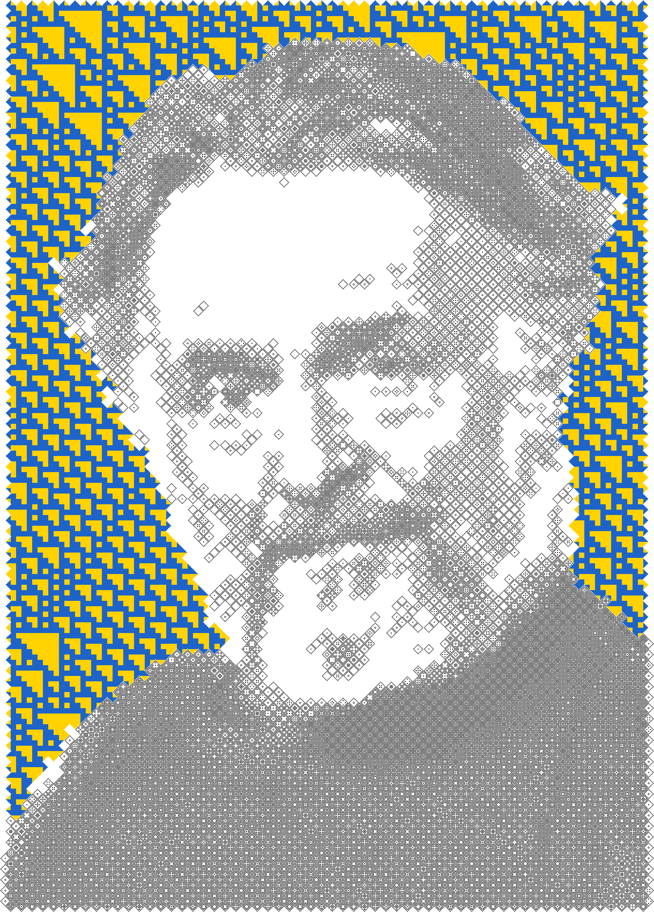

# Game of Life Mosaics

> Create intricate artistic mosaics from images using Conway's Game of Life Still Life patterns

Transform your photos into unique digital art pieces composed entirely of Game of Life patterns. Each mosaic is a carefully crafted arrangement of living, stable patterns from Conway's Game of Life, decorated with Elementary Cellular Automaton backgrounds.

## Gallery

<p align="center">
  
</p>
<p align="center"><em>Game of Life Mosaic of a portrait of John H. Conway.</em></p>

<p align="center">
  
</p>
<p align="center"><em>Game of Life Mosaic with ECA background.</em></p>

## What is This?

This project combines two fascinating computational concepts to create digital art:

1. **Game of Life (GoL) Still Lives**: Stable patterns in Conway's Game of Life that never change. These symmetric patterns are composed of Tiles: diamond-shaped symmetric patterns computed using integer linear programming to find all valid configurations.

2. **Elementary Cellular Automata (ECA)**: Simple one-dimensional cellular automata that create various background patterns according to Wolfram rules.

The result is a unique mosaic where:
- Darker/lighter regions of your image are mapped to denser/sparser GoL patterns
- An ECA pattern fills transparent areas with intricate backgrounds
- Everything is automatically and randomly generated, but also fully customisable

## Features

- **Automatic mosaic generation** from any image (PNG, JPG, GIF)
- **Two tile shapes**: the classic 45° *diamond* layout (diamond tiles on two interlocking diagonal grids, glued by shared ponds) and the axis-aligned *square* layout (square tiles bordered by a ring of ponds, sharing their border ponds) — select with `MosaicGenerator(tile_shape="diamond" | "square")`
- **Pre-computed complexity levels**: diamonds 1–6 (levels 1–2 are trivial, 3–6 give the best results — level 6 alone holds 332,321 exhaustively enumerated tiles), squares 3–5 (censuses 3, 65 and 10,398; see `gol_mosaics.tile_scheme` and `notebooks/tile_scheme_generalisation.ipynb` for the underlying geometry)
- **Customisable colour schemes** (UGent colours, monochrome, Warhol palette, or custom)
- **ECA background overlays** with multiple rule options
- **Export to Golly format** for Game of Life simulation (collapsing the Still Life)
- **Clean object-oriented API** designed for extensibility
- **Comprehensive documentation** and examples

## Installation

### Basic Installation

```bash
# Clone the repository
git clone https://github.com/mrollier/game-of-life-mosaics.git
cd game-of-life-mosaics

# Install the library (editable)
pip install -e .
```

> `requirements.txt` is the dependency set for the web app (it additionally
> pins gradio and rembg); library users only need the install above.

### Dependencies

- **numpy** (>=1.20.0) - Numerical computing
- **scipy** (>=1.7.0) - Scientific computing (binary_fill_holes)
- **cellpylib** (>=2.0.0) - Cellular automaton simulation
- **Pillow** (>=9.0.0) - Image processing
- **python-sat** (>=1.8) - SAT solver (optional; only for generating new patterns/levels/rules)
- **gurobipy** (>=11.0.0) - Optimisation solver (optional; historical generation path)
- **rembg** (>=2.0.0) - Automatic background removal (optional)

> **Note on pattern generation**: using the pre-computed patterns (levels 1–6) needs no extra dependencies. New levels or Life-like rule variants are generated with the open-source SAT pipeline (`pip install gol-mosaics[sat]`; see `gol_mosaics.sat_search` and `notebooks/tile_generation_sat.ipynb` for the method and its validation). The historical Gurobi ILP (`PatternLibrary.generate`, licence from [gurobi.com](https://www.gurobi.com/)) is retained for reference but is dramatically slower — days versus seconds for level 6.

> **Note on background removal**: `rembg` is only required when the algorithm removes an image's background for you (the `remove_background='auto'` default, or `remove_background=True`). Install it with `pip install gol-mosaics[bg-removal]`. If your images already have transparent backgrounds, you don't need it.
>
> Removal automatically prefers any available GPU/accelerator (CoreML on Apple Silicon, or CUDA if you have installed `onnxruntime-gpu`) and otherwise uses the CPU. To force CPU, set `ImageProcessor.background_removal_providers = ['CPUExecutionProvider']` before the first removal.

## Quick Start

Start with a portrait image. If its background is still present, it is removed
automatically (the `remove_background='auto'` default), which needs the optional
`rembg` package (`pip install gol-mosaics[bg-removal]`).

_Tip_: you can also remove the background yourself beforehand using [removebg](https://www.remove.bg/), Canva, or other photo editing applications, and then pass `remove_background=False`.

```python
from gol_mosaics import MosaicGenerator

# Create generator
generator = MosaicGenerator(level=5, grid_size=100)

# Generate mosaic from image
mosaic = generator.generate_from_image('portrait.png')

# Save result
mosaic.save('output.png')
```

That's it! You now have a Game of Life mosaic.

## Usage Guide

### Basic Usage

```python
from gol_mosaics import MosaicGenerator

# Simple usage with defaults (UGent colours)
generator = MosaicGenerator(level=5, grid_size=100)
mosaic = generator.generate_from_image('input.png')
mosaic.save('output.png')
```

### Custom Colours

```python
from gol_mosaics import MosaicGenerator, ColorScheme

# Use a preset colour scheme
colors = ColorScheme.monochrome()

# Or use a Andy Warhol palette
colors = ColorScheme.warhol()

# Or create custom colours
colors = ColorScheme(
    gol_background='#FFFFFF',  # white
    gol_pixel='#000000',       # black
    eca_background='#FFD200',  # yellow
    eca_pixel='#1E64C8'        # blue
)

generator = MosaicGenerator(
    level=5,
    grid_size=100,
    color_scheme=colors
)

mosaic = generator.generate_from_image('input.png')
mosaic.save('output.png')
```

### Advanced Parameters

```python
from gol_mosaics import MosaicGenerator, ColorScheme

generator = MosaicGenerator(
    level=5,                    # Pattern complexity (1-6; 3-6 recommended)
    grid_size=100,              # Number of tiles (must be even for diamonds)
    color_scheme=ColorScheme.ugent(),
    eca_rule=106,               # ECA rule (30, 45, 54, 106, 110, etc.)
    tile_shape="diamond",       # "diamond" (default) or "square"
)

mosaic = generator.generate_from_image(
    'portrait.png',
    empty_tiles_cutoff=0.6,     # Threshold for empty tiles (0-1)
    alpha_cutoff=0.8,           # Transparency threshold (0-1)
    supersample=15              # ECA detail level
)

mosaic.save('output.png')
```

### Parameter Guide

- **tile_shape** ("diamond" or "square"): Tile geometry. Diamonds are the classic 45° layout; squares are axis-aligned tiles whose adjacent border ponds are shared. Both compose into provable global still lifes.
- **level**: Pattern complexity. Higher = more detailed but larger files. Pre-computed: diamonds 1-6 (levels 1-2 are trivial; 3-6 recommended; level 6 ships as 2.7 MB of packed symmetry-orbit bits and expands to ~450 MB of tiles on first load), squares 3-5 (all shipped as packed orbit bits, ~60 KB total).
- **grid_size** (must be even for diamonds; squares take any size): Number of tiles across. Higher = more detail but slower. Typical: 30-150.
- **eca_rule**: Wolfram rule for background pattern.
  - Complex: 54, 147, 110, 124, 137, 193
  - Chaotic: 30, 45, 106, 150
  - Any rule between 0-255 is fine
- **empty_tiles_cutoff** (0-1): Brightness threshold above which tiles are empty. Lower = more empty tiles.
- **alpha_cutoff** (0-1): Transparency threshold. Transparent areas get filled with ECA pattern.
- **supersample**: ECA cell size in pixels (any positive value; the pattern is cropped to the mosaic size). Higher = chunkier ECA cells. `None` (default) auto-selects ~15.
- **contrast**: Sigmoid (S-curve) contrast boost on the greyscale before tiling. 0 disables; higher is punchier (default 5.0). High-contrast images give the most striking mosaics.

### Working with Pattern Library

The building blocks of the Mosaics are the Tiles. These are called in the `PatternLibrary` class.

```python
from gol_mosaics import PatternLibrary
import numpy as np

# Load pre-computed patterns
library = PatternLibrary.load(level=5)                 # diamond tiles
squares = PatternLibrary.load(level=5, shape="square")  # square tiles (3-5)

# Get a single pattern for a greyscale value
pattern = library.get_pattern_for_value(0.5, random=True)

# Map array of values to patterns
values = np.array([[0.2, 0.5], [0.7, 0.9]])
patterns = library.get_patterns_for_values(values, random=True, invert=True)

# Enumerate Tiles yourself with the open-source SAT pipeline
# (pip install gol-mosaics[sat]) - exhaustive, and fast:
from gol_mosaics.sat_search import enumerate_tiles
tiles = enumerate_tiles(level=5)                    # all 2632 level-5 Tiles
highlife = enumerate_tiles(level=5, birth=(3, 6))   # ...or for HighLife B36/S23
```

### Export to Golly

The resulting Mosaic (without background) can be exported as a `.cells` file for importing into [Golly](https://golly.sourceforge.io/webapp/golly.html). If you add a glider, you can observe the Mosaic falling apart like a house of cards.

```python
from gol_mosaics import GollyExporter
import numpy as np

# After generating your mosaic, convert to binary and export
mosaic_array = np.array(mosaic.convert('L')) > 128
GollyExporter.export_to_cells(mosaic_array, 'output/golly/my_mosaic.cells', add_glider='bottom right')

# Now open output/golly/my_mosaic.cells in Golly to see your mosaic as a Game of Life pattern!
```

### Processing GIFs

You can also turn an animated GIF into an animated Mosaic.

```python
from gol_mosaics import MosaicGenerator

generator = MosaicGenerator(level=4, grid_size=50)
mosaic_gif = generator.generate_from_gif('animation.gif')
mosaic_gif.save('output.gif', save_all=True)
```

## How It Works

### GoL Still Lives

Conway's Game of Life is a cellular automaton where cells live or die based on their neighbours:
- A living cell with 2-3 neighbours survives
- A dead cell with exactly 3 neighbours becomes alive
- All other cells die

**Still Lives** are stable patterns that never change. This project uses **8-fold symmetric Still Lives**, exhaustively enumerated at each complexity level with a SAT solver over the free symmetry orbits (originally via a Gurobi ILP; see `notebooks/tile_generation_sat.ipynb` for the method, its five-tier validation, and the generalisation to other Life-like rules).

The complete counts per level: 1, 2, 7, 85, 2632, and **332,321** unique symmetric patterns for levels 1–6, ranging from sparse to dense.

### Pattern Mapping

1. **Image preprocessing**: Load image, make square with padding, convert to greyscale
2. **Rotation**: Rotate 45° to create diamond layout
3. **Pixelation**: Downsample to grid of tiles
4. **Diagonal extraction**: Extract two interlocking diagonal grids
5. **Density matching**: Map each tile's brightness to the closest GoL pattern by density
6. **Reconstruction**: Assemble patterns into final mosaic
7. **Aspect ratio adjustment**: Crop to original proportions

### Elementary Cellular Automata

ECAs evolve from a random initial row according to simple rules. Each new row depends only on the three cells above it. Different rules create different patterns:

- **Rule 30**: Random, chaotic
- **Rule 54**: Complex, intricate
- **Rule 106**: Chaotic with structure
- **Rule 110**: Turing-complete, complex

The ECA pattern is generated at low resolution and upsampled to overlay on the mosaic, filling transparent areas with texture.

### Diamond Layout

The 45° rotation creates a diamond-like tiling effect. Two diagonal grids interlock, with padding between tiles. This gives the characteristic diagonal aesthetic of these mosaics.

## API Reference

### MosaicGenerator

Main API for generating mosaics.

**Constructor:**
```python
MosaicGenerator(level=4, grid_size=30, color_scheme=None,
                eca_rule=106, random_patterns=True, invert=True,
                tile_shape="diamond")
```

**Methods:**
- `generate_from_image(image_path, empty_tiles_cutoff=0.65, alpha_cutoff=0.5, supersample=None, no_eca=False, remove_background='auto', contrast=5.0, seed=None)` - Generate from image file
- `generate_from_pil(img, ..., return_arrays=False)` - Same pipeline for an in-memory PIL image; `return_arrays=True` also returns the binary GoL mosaic and transparency mask
- `generate_from_gif(gif_path, ...)` - Process animated GIF (same defaults as the image path)

### PatternLibrary

Manages Game of Life patterns.

**Class Methods:**
- `PatternLibrary.load(level, shape="diamond")` - Load pre-computed patterns (diamonds 1-6, squares 3-5)
- `PatternLibrary.generate(level, solution_limit)` - Generate new patterns

**Methods:**
- `get_pattern_for_value(value, random, invert)` - Get single pattern
- `get_patterns_for_values(values, random, invert, empty_tiles_cutoff)` - Map multiple values
- `get_patterns_for_mask(mask, alpha_cutoff)` - Map transparency mask

### ColorScheme

Immutable colour configuration (dataclass).

**Class Methods:**
- `ColorScheme.ugent()` - UGent brand colours (default)
- `ColorScheme.monochrome(foreground, background)` - Two-colour scheme
- `ColorScheme.warhol()` - Colours inspired by Andy Warhol's pop art

**Attributes:**
- `gol_background` - Background colour for GoL patterns
- `gol_pixel` - Foreground colour for GoL patterns
- `eca_background` - Background colour for ECA overlay
- `eca_pixel` - Foreground colour for ECA overlay

### GollyExporter

Export to Golly simulator format.

**Static Methods:**
- `export_to_cells(mosaic, filename, add_glider)` - Export to .cells format. `add_glider` is `None` (default) or a corner: `'top left'`, `'top right'`, `'bottom left'`, `'bottom right'`
- `export_to_rle(mosaic, filename, name, comments)` - Export to RLE format

### ECABackground

Generate Elementary Cellular Automaton patterns.

**Constructor:**
```python
ECABackground(rule=106)
```

**Methods:**
- `generate(width, height, supersample)` - Generate ECA pattern (any positive supersample; the result is cropped to size)

**Class Methods:**
- `from_category(category)` - Create with 'complex' or 'chaotic' rule

### ImageProcessor

Image loading, background removal, and preprocessing.

**Methods:**
- `load_image(image_path, alpha_color, return_alpha, remove_background='auto', contrast=5.0)` - Load with alpha handling
- `has_background(img, opaque_threshold=0.99)` - Detect whether a background is still present
- `remove_background(img, model='u2net', alpha_matting=False, **kwargs)` - Remove the background with `rembg` (returns RGBA)
- `enhance_contrast(img, contrast=5.0, midpoint=0.5)` - Sigmoid (S-curve) contrast boost on a greyscale image
- `square_image(img, return_aspect, fill_color)` - Pad to square
- `rotate_and_pixelate(img, grid_size, expand)` - Rotate 45° and pixelate
- `extract_diagonal_patterns(lowres)` - Extract two diagonal grids
- `preprocess_for_mosaic(image_path, grid_size, remove_background='auto', contrast=5.0)` - Complete preprocessing pipeline

### MosaicRenderer

Render arrays as coloured images.

**Constructor:**
```python
MosaicRenderer(color_scheme)
```

**Methods:**
- `render_gol_mosaic(mosaic)` - Render GoL pattern with colours
- `render_eca_overlay(eca_mask)` - Render ECA overlay with transparency
- `composite(base, overlay)` - Alpha-composite images
- `render_full_mosaic(gol_mosaic, eca_mask)` - Complete rendering pipeline

## Examples

See the [notebooks/](notebooks/) directory for Jupyter notebooks with detailed examples:

- **quickstart.ipynb** - Simple 10-line example to get started
- **preprocessing_demo.ipynb** - Explore the preprocessing steps: background removal (models, alpha matting) and the S-curve contrast boost
- **parameter_demo.ipynb** - Demonstration of the visual effect of some of the most important parameters
- **playground.ipynb** - Notebook in which you can easily play around with the parameter values yourself
- **golly.ipynb** - Demonstration of how to export a Mosaic as a `.cells` file for import into Golly
- **tile_generation.ipynb** - Step by step demonstration of the creation of the Tiles
- **open_problems.ipynb** - Inspiration for next steps within this repo

## Contributing

Contributions are welcome! Areas for improvement are listed in the `open_problems.ipynb` Notebook.

Please open an issue to discuss major changes before submitting a PR.

## Testing

Run the test suite:

```bash
pytest tests/ -v
```

Run with coverage:

```bash
pytest tests/ --cov=src/gol_mosaics --cov-report=html
```

## Project Structure

```
game-of-life-mosaics/
├── src/
│   └── gol_mosaics/           # Main package
│       ├── mosaic.py          # MosaicGenerator (main API)
│       ├── patterns.py        # PatternLibrary (GoL patterns)
│       ├── colors.py          # ColorScheme (colour management)
│       ├── image_processing.py # ImageProcessor (preprocessing)
│       ├── eca.py             # ECABackground (background generation)
│       ├── renderer.py        # MosaicRenderer (colour rendering)
│       └── export.py          # GollyExporter (format export)
├── data/                      # Pre-computed pattern solutions
|   ├── solutions_pattern_level_1.npy
|   ├── solutions_pattern_level_2.npy
│   ├── solutions_pattern_level_3.npy
│   ├── solutions_pattern_level_4.npy
│   ├── solutions_pattern_level_5.npy
│   ├── solutions_pattern_level_6_orbits.npy  # 332,321 tiles as packed orbit bits
│   └── solutions_square_level_{3,4,5}_orbits.npy  # square tiles as packed orbit bits
├── tests/                     # Unit and integration tests
├── notebooks/                 # Example Jupyter notebooks
├── input/                     # Example input images
│   ├── images/                # Example images for testing
|   └── gifs/                  # Directory for your input GIFs
├── output/                    # Generated mosaics
│   ├── images/                # PNG output examples
|   ├── gifs/                  # Directory for your output GIFs
│   └── golly/                 # .cells files for Golly simulator
├── requirements.txt           # Python dependencies
├── LICENSE                    # MIT License
└── README.md                  # This file
```

## Acknowledgments

The motivation for this repo and the ideas behind the integer linear programming was taken from the excellent and inspiring 2019 book "[Opt art: from mathematical optimization to visual design](https://press.princeton.edu/books/hardcover/9780691164069/opt-art)" by Robert Bosch.

This project builds on several excellent libraries and concepts:

- **gurobipy**: Powerful optimisation solver for finding GoL patterns
- **cellpylib**: Elementary Cellular Automaton simulation
- **NumPy/SciPy**: Numerical computing foundation
- **Pillow**: Image processing
- **Conway's Game of Life**: Classic cellular automaton by John Conway
- **Stephen Wolfram**: Elementary Cellular Automata classification

Special thanks to:
- Ghent University (UGent) for colour inspiration
- The Game of Life community for pattern catalogues and inspiration
- Everyone who contributed to the underlying mathematical and computational concepts

## License

MIT License - see [LICENSE](LICENSE) file for details.

Copyright (c) 2026 Michiel Rollier

## Citation

If you use this project in academic work, please cite:

```bibtex
@software{rollier2026golmosaics,
  author = {Rollier, Michiel},
  title = {Game of Life Mosaics: Digital Art using GoL Still Lives},
  year = {2026},
  url = {https://github.com/mrollier/game-of-life-mosaics}
}
```

as well as the original work:

```bibtex
@book{bosch2019optart,
  author = {Bosch, Robert},
  title = {Opt art: from mathematical optimization to visual design},
  publisher = {Princeton University Press},
  year = {2019},
  isbn = {0-691-19703-2}
}
```

---

Made with ❤️ and Game of Life patterns
