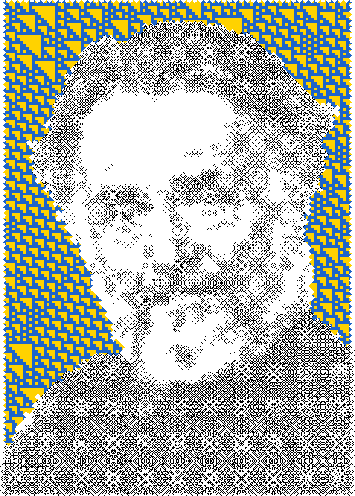

# Game of Life Mosaics

> Portraits made of Conway's Game of Life still lifes: patterns that never change.

<p align="center">
  
</p>
<p align="center"><em>John H. Conway, as one Game of Life still life.</em></p>

Every dark region of the picture is filled with a dense still life, every light
region with a sparse one, and the whole image is a single Game of Life pattern:
load it into a simulator and nothing moves, until you send in a glider. The
coloured background is an elementary cellular automaton.

**Try it in the browser, no installation:**
[huggingface.co/spaces/mrollier/game-of-life-mosaics](https://huggingface.co/spaces/mrollier/game-of-life-mosaics)

<p align="center">
  
</p>

## Install

```bash
git clone https://github.com/mrollier/game-of-life-mosaics.git
cd game-of-life-mosaics
pip install -e .
```

Python 3.10 or newer. Optional extras: `[bg-removal]` removes a photo's
background automatically, `[beyond]` adds the free-form solver, `[sat]` the tile
search, `[app]` the web app, `[dev]` tests and notebooks; for example
`pip install -e ".[bg-removal]"`.

## Make a mosaic

```python
from gol_mosaics import MosaicGenerator

mosaic = MosaicGenerator(level=4, grid_size=60).generate_from_image('input/images/john.png')
mosaic.save('john_mosaic.png')
```

`john.png` has a transparent background; for your own photo, remove the
background first or install `[bg-removal]` to have it done for you. Settings,
colours, square tiles and Golly export: [the usage guide](docs/usage.md).

## Two ways to build a still life

**Tile mosaics** (`MosaicGenerator`) assemble the picture from pre-computed
*tiles*: small still lifes inside a shared frame of ponds that glue together
into one still life, whatever the choice of tiles. Every tile of every size is
known. There are 332,321 at level 6, found by exhaustive SAT enumeration. A
mosaic takes seconds.

**Free-form still lifes** (`gol_mosaics.freeform`) solve the whole picture
cell by cell with a constraint solver, so the texture follows the image
instead of a tile vocabulary. A poster takes minutes to hours.
[More](docs/freeform.md).

## Where to go next

| If you want to | Go to |
|---|---|
| play with settings and see the results | [notebooks/tutorials](notebooks/README.md), starting with `01_quickstart` |
| understand every setting | [docs/usage.md](docs/usage.md) |
| look something up in the API | [docs/api.md](docs/api.md) (with the 2.x to 3.0 renames) |
| see what the words mean | [docs/glossary.md](docs/glossary.md) |
| understand how the tiles work and how they were counted | [docs/tiles.md](docs/tiles.md) |
| solve free-form still lifes | [docs/freeform.md](docs/freeform.md) |
| reproduce the paper's numbers | [docs/reproduce.md](docs/reproduce.md) and [search/](search/README.md) |
| see finished commissions | [studies/](studies/README.md) |
| find your way around the repository | [docs/repo_map.md](docs/repo_map.md) |
| run or deploy the web app | [docs/deploy.md](docs/deploy.md) |
| contribute, or pick up an open problem | [CONTRIBUTING.md](CONTRIBUTING.md) and [docs/roadmap.md](docs/roadmap.md) |

## The numbers

Symmetric tiles per level, levels 1-8: 1, 2, 7, 85, 2,632, 332,321,
108,492,376 and 172,693,540,438. Levels 1-6 ship with the package; level 7 was
enumerated and level 8 counted without enumerating. Both are described in
[docs/tiles.md](docs/tiles.md).

## Acknowledgements

The idea of Game of Life mosaics, and the integer-programming approach this
project started from, come from Robert Bosch's *Opt Art: From Mathematical
Optimization to Visual Design* (Princeton University Press, 2019) and Bosch and
Olivieri's *Game-of-Life Mosaics* (Bridges 2014). The Game of Life is John
Conway's; the elementary cellular automata are Stephen Wolfram's. The tile
search uses CaDiCaL and Glucose through python-sat, the free-form solver
OR-Tools CP-SAT, and background removal rembg.

## Citation

```bibtex
@software{rollier2026golmosaics,
  author = {Rollier, Michiel},
  title  = {Game of Life Mosaics: Digital Art using Game of Life Still Lifes},
  year   = {2026},
  url    = {https://github.com/mrollier/game-of-life-mosaics}
}

@book{bosch2019optart,
  author    = {Bosch, Robert},
  title     = {Opt Art: From Mathematical Optimization to Visual Design},
  publisher = {Princeton University Press},
  year      = {2019},
  isbn      = {0-691-19703-2}
}
```

## Licence

MIT, see [LICENSE](LICENSE). Copyright (c) 2026 Michiel Rollier.
