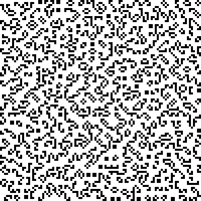
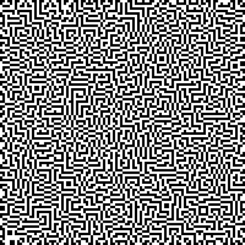
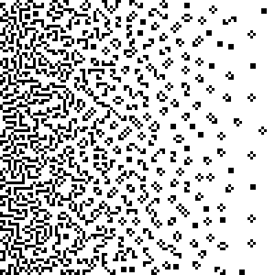
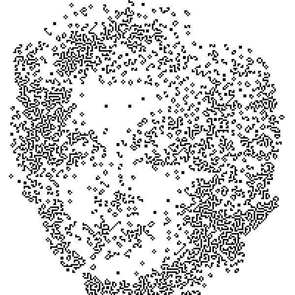
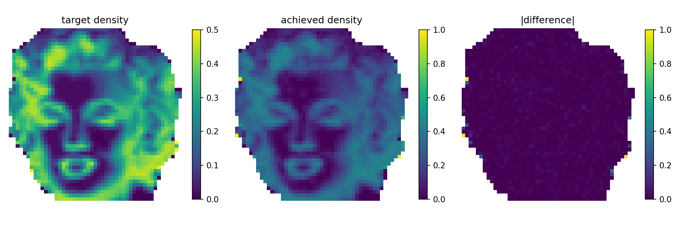
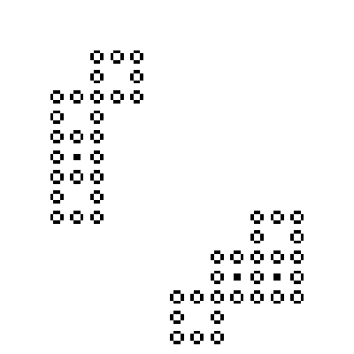
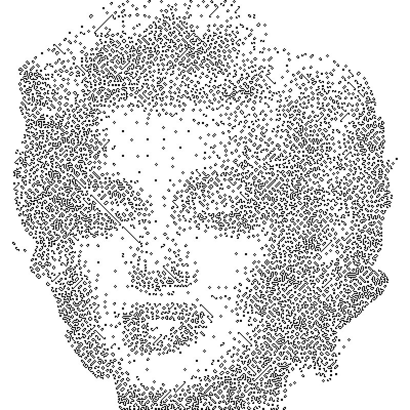
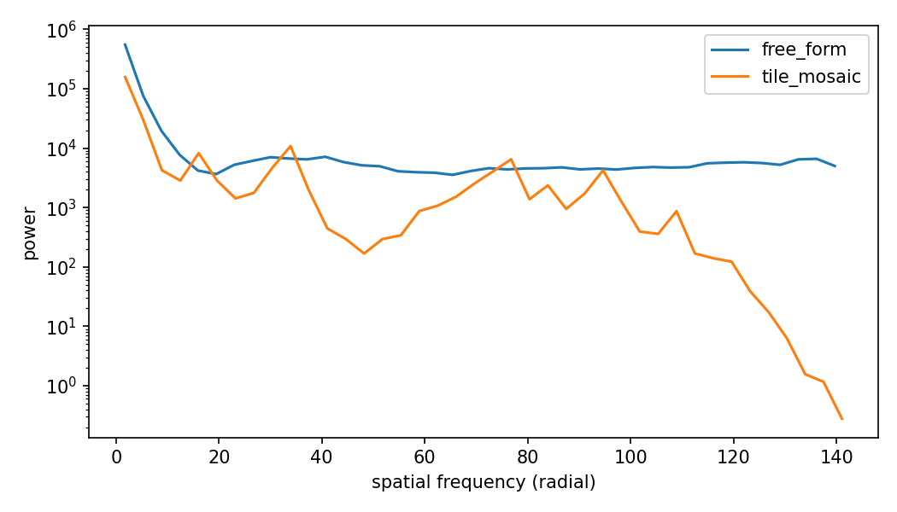
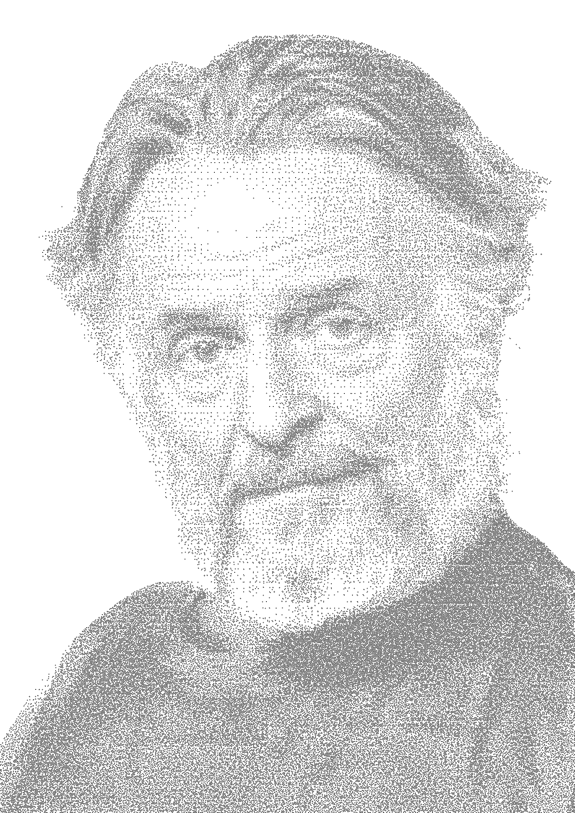

# Beyond Tiles — feasibility spike report

**Question.** Can a greyscale image be mapped onto a single large Game-of-Life
still life that (i) is globally static, (ii) locally tracks the image's grey
values in live-cell density, and (iii) is not assembled from a tile
vocabulary — and can an exact solver do it fast?

**Verdict: YES — decisively feasible.** A 200×200-cell portrait solves to
*proven optimality* (total window deviation 2 cells) in **87 seconds** on an
Apple M4, is verified stable by three independent checkers, is unmistakably
recognizable, and its texture is quantifiably non-tiled (92% of its 6×6
blocks are unique; a tile mosaic reuses 8). Recommended configuration:
non-overlapping 8×8 windows, d_max 0.45, histogram-equalized subject tones,
hard-masked background. Every feasibility gate passed; details in §3–4.

## 1. Prior art

No published work combines greyscale density targets, non-tiled still lifes,
and exact solving. The pieces exist separately:

- **Bosch & Olivieri, "Game-of-Life Mosaics" (Bridges 2014; J. Math. Arts
  2014).** Modular approach: a census of symmetric square still-life tiles at
  different densities, one tile per image patch, selected by nearest average
  grey. This repository is that approach, industrialised (SAT-based level-6
  census of 332,321 tiles). The baseline we move beyond.
- **Verrill, "Conway Still Life Drawing" (Bridges 2022).** The closest work,
  and the only non-modular one: fills *binary* shape masks with ~50%-density
  still lifes via a randomised continuous-Life relaxation (life value ℓ,
  threshold L, increment δ), interpretable as simulated annealing. Explicitly
  contrasts itself with Bosch–Olivieri's modularity. Limitations: binary masks
  only (no greyscale gradation), density pinned near 50%, stochastic with
  manual parameter nudging, and slow — single 40×40 letters took 3 minutes to
  3 hours. No solver, no density control.
- **Chu & Stuckey, "A complete solution to the Maximum Density Still Life
  Problem" (Artificial Intelligence 184–185, 2012).** Solves max-density
  still lifes for all n via a "wastage" reformulation and lazy clause
  generation (CSPLib prob032 lineage). Establishes that constraint technology
  handles still-life structure at the ~100×100 scale, and that finite regions
  slightly exceed density ½ (8×8 optimum: 36/64 = 0.5625).
- **Elkies, "The still-life density problem and its generalizations" (1998).**
  Proves no still life exceeds density ½ asymptotically. Consequence for any
  density-graded rendering: greyscale must be remapped to [0, ~0.5], and
  regions near the ceiling are forced into near-periodic stripe/maze textures.
- **Knuth, SAT-LIFE programs (2013) and TAOCP 7.2.2.2.** Canonical
  Life-as-SAT encodings. **Logic Life Search** (LifeWiki) generalises
  SAT-based pattern search. Kevin Gal's "Finding Mona Lisa in the Game of
  Life" (2020, blog) uses SAT for image *predecessor* search — a different
  problem (transient dynamics, not still lifes).

## 2. Method

One CP-SAT model (Google OR-Tools ≥ 9.12), `experiments/beyond_tiles/`:

- **Variables.** One BoolVar per cell on an (H+2)×(W+2) grid. The border ring
  is forced dead but still carries the no-birth constraint, so solutions are
  still lifes embedded in a dead plane (verified independently, twice).
- **Stability (hard).** Per cell, with S = Σ in-grid Moore neighbours:
  alive → S ∈ [2,3]; dead → S ∈ {0,1,2,4,…,8}. Two half-reified linear
  constraints per cell; no auxiliary booleans.
- **Density (soft).** Greyscale → per-cell target d = d_max·(1 − g/255)
  (live = dark; d_max = 0.45 default, respecting the Elkies ceiling), after
  the tile pipeline's own load path (alpha handling, optional rembg, sigmoid
  contrast) and — decisive for real photographs, see E2 — histogram
  equalization of the grey values inside the subject mask (`--tone eq`). Overlapping k×k windows (default k=8, stride 4, clamped at
  edges); integer target t_w per window summed over unmasked cells; deviation
  var per window; **minimize Σ_w |live_w − t_w|**.
- **Anytime semantics.** All-dead is trivially feasible, so the solver always
  holds an incumbent and improves it; we accept the best solution at the time
  limit. Seeds give distinct equally-valid patterns ("new variation").
- **Verification.** Every result must pass `gol_mosaics.life.is_still_life`
  on the pad-1 embedding (complete: births ≥2 cells away are impossible) AND
  `gol_mosaics.sat_search.rule_violations` (independent toroidal check),
  plus a manual Golly step of the exported `.cells` file.

Metrics: window-density MAD (mean |achieved − target|, density units), p95,
max, darkest-quartile MAD, Pearson correlation between achieved and target
window fields; texture: distinct-motif entropy and `tile_db_overlap` (fraction
of 6L×6L blocks that are verbatim level-L tiles mod D4).

Feasibility gates (fixed before the runs): G1 incumbent ≤ 600 s at 100×100 on
an Apple M4 (10 workers); G2 MAD ≤ 0.05 (marginal to 0.10), darkest-quartile
MAD ≤ 0.08, Pearson ≥ 0.85; G3 both stability checks + Golly; G4 recognizable
side-by-side vs a tile mosaic.

## 3. Results

### E1 — synthetic targets (100×100, 120 s each, 10 workers)

| target | objective | window MAD | Pearson | still life |
|---|---|---|---|---|
| uniform d=0.1 | 223 | 0.0110 | — | ✓✓ |
| uniform d=0.2 | 173 | 0.0076 | — | ✓✓ |
| uniform d=0.3 | 181 | 0.0073 | — | ✓✓ |
| uniform d=0.4 | 183 | 0.0090 | — | ✓✓ |
| uniform d=0.5 | 635 | 0.0172 | — | ✓✓ |
| linear ramp 0→0.45 | 225 | 0.0086 | 0.995 | ✓✓ |
| radial ramp | 197 | 0.0080 | 0.991 | ✓✓ |

(✓✓ = bounded `is_still_life` on the pad-1 embedding AND the independent
toroidal `rule_violations` check. Pearson is undefined for uniform targets.)

Every density band up to the Elkies ceiling is reachable within MAD ≤ 0.02 in
two minutes; ramps track their targets at Pearson ≥ 0.99. Even the d = 0.5
probe — sitting exactly on the asymptotic bound — lands within 0.017 mean
absolute density error (its ~3× higher objective is the expected ceiling
effect). Textures: d ≤ 0.3 reads as organic scatter of small objects; d = 0.5
locks into the predicted high-density texture, but a varied multi-directional
labyrinth rather than monotone stripes.

*E1 renders: uniform d = 0.3 (organic scatter), uniform d = 0.5 (the
high-density labyrinth at the Elkies ceiling), and the linear ramp.*

### E2 — Marilyn headline

**Tone mapping matters more than the solver.** The first runs (absolute
mapping d = d_max·(1 − g/255)) produced perfect density tracking (MAD 0.008,
Pearson 0.99) of an almost-empty target field: the Marilyn source is high-key
(subject median grey 234), so a faithful absolute mapping renders the face at
density ≈ 0.03. The tile pipeline never shows this failure because its
grey→tile mapping is *relative* (min–max-normalised tile densities plus the
empty-tile cutoff stretch). The free-form analogue is **histogram
equalization inside the subject mask** (`equalize_grey`), which centres the
subject's median at density ≈ 0.23 — the sweet spot for organic still-life
texture. Percentile stretching alone does not help (the subject's range is
already full; its *distribution* is the problem).

*The equalized 100² input — the actual greyscale the solver's density
targets are derived from.*

Results with equalization (force_dead mask, 10 workers, M4):

| run | k/stride | budget | objective | MAD | Pearson | still life |
|---|---|---|---|---|---|---|
| 100², seed 0 | 8/4 | 300 s | 136 | 0.0128 | 0.957 | ✓✓ |
| 100², seed 0 | 6/3 | 300 s | 298 | 0.0222 | 0.912 | ✓✓ |
| **200², seed 0** | 8/4 | 900 s | 662 | 0.0124 | 0.960 | ✓✓✓ |
| **200², seed 0** | **8/8** | **87 s (OPTIMAL)** | **2** | 0.0091 | 0.951 | ✓✓ |
| 400², seed 0 | 8/8 | 2400 s cap (FEASIBLE) | 2874 | 0.0288 | 0.923 | ✓✓ |

(✓✓✓ = the two internal checks plus a third-party check: cellpylib evolved
the 200² pattern 10 generations — bit-identical. 6,743 live cells, overall
density 0.169. The exported `.cells` files were additionally opened in Golly
and stepped by hand: static, as required — the external G3 check.)

*The 200² solutions: overlapping-window run (left) and the disjoint-window
proven optimum (right).*

*Window-density fidelity of the 200² optimum: target field, achieved field,
absolute difference.*

**Recognizability:** at 100×100 the head, hair mass and face shape read
clearly but facial features are marginal — the canvas, not the solver, is the
limit (the density field has only ~24×24 effective windows). At **200×200 the
portrait is unmistakably Marilyn**: hair texture, eyes, lips and shading all
resolve. Convergence plateaus by ~250 s at 100² (2836 → 122 objective) and
within the 900 s budget at 200².

**Side-by-side at equal cell budget:** a square-tile mosaic (level 3) on a
~106-cell canvas fits only 8×8 tiles and renders two disconnected pond
clusters — no likeness whatsoever. The free-form solve at the same cell count
carries an entire portrait. Tile mosaics need roughly a 10× larger canvas
(grid ≈ 100 tiles ⇒ ~1,200+ cells across) to compete on detail.

*The square-tile mosaic at the same ~106-cell budget: two disconnected pond
clusters, no likeness.*

### E3 — knob study (100², eq tone, 90 s each, one factor at a time)

| variant | status | objective | MAD | Pearson |
|---|---|---|---|---|
| default (k8 s4, seed 0) | FEASIBLE | 212 | 0.0153 | 0.945 |
| seed 1 / seed 2 | FEASIBLE | 180 / 202 | 0.0129 / 0.0154 | 0.970 / 0.944 |
| k6 s3 | FEASIBLE | 350 | 0.0227 | 0.922 |
| k12 s6 | FEASIBLE | 195 | 0.0139 | 0.913 |
| **k8 s8 (non-overlapping)** | **OPTIMAL** | **0** | **0.0086** | 0.979 |
| d_max 0.40 / 0.50 | FEASIBLE | 188 / 185 | 0.0147 / 0.0143 | 0.927 / 0.964 |

Findings: seeds vary texture, not quality (the "new variation" knob works).
Finer windows (k6) are strictly harder within a fixed budget; k12 costs
detail resolution for little gain. d_max is insensitive in the 0.40–0.50
band. **The headline finding is stride:** disjoint windows make the
instance easy — CP-SAT closes it to *proven optimal, zero total deviation,
in 16 s* (vs 20–50× longer for a worse incumbent with 50% overlap), with no
visible block seams and the best MAD of the batch. The overlap constraint
coupling, not the still-life structure, is what makes the optimization hard.
The user's original moving-window intuition is thus best realised as
*disjoint* per-window exact counts; window-to-window smoothness emerges from
the shared stability constraints across window borders anyway.

### E4 — scale probe

200×200 (40,804 booleans, ~81.6k reified constraints, 2,401 windows): best
incumbent within 900 s overlapping, 87 s to *optimal* disjoint — no quality
degradation vs 100², and the larger canvas is what unlocks recognizability.

400×400 (161,604 booleans, ~323k constraints, 1,968 subject windows,
4.6 GB peak RSS): proven optimality does **not** close within a 2,400 s cap —
the wall-clock for optimality is strongly super-linear beyond 200²
(measured: 16 s → 87 s → >2,400 s for 100²/200²/400² disjoint). The 40-min
*incumbent* is still the best-looking render of the series (MAD 0.0288,
Pearson 0.92, verified still life), with the deficit concentrated where
expected: the darkest quartile of windows (MAD 0.082, marginally over its
0.08 bar) — near-ceiling densities are combinatorially hardest, so the
solver leaves them slightly under-filled when time runs out. For posters
beyond 400², strip decomposition or longer budgets remain the fallback;
for ≤200² the method is effectively instant and exact.

*The 40-minute 400² incumbent (MAD 0.0288) — the baseline the optimization
campaign in §5 set out to beat.*

### E5 — texture: is it really "beyond tiles"?

Motif census over non-empty blocks, free-form 200² vs square-tile mosaic
(level 3, 202² canvas) of the same image:

| | 4×4 distinct / blocks | 4×4 entropy | 6×6 distinct / blocks | 6×6 entropy |
|---|---|---|---|---|
| free-form | 911 / 1642 | 9.08 bits | **722 / 782 (92% unique)** | 9.43 bits |
| tile mosaic | 13 / 658 | 3.32 bits | 8 / 412 | 2.77 bits |

A ~6.6-bit entropy gap at 6×6 means the free-form texture draws from a
vocabulary roughly two orders of magnitude richer; 92% of its 6×6 blocks
occur exactly once. `tile_db_overlap` (verbatim level-1 tiles mod D4) is 0.0
for the free-form pattern, confirming no accidental reconstruction of the
tile vocabulary. (It is also 0 for the square-tile mosaic, whose tiles are
pond-frame squares rather than level-1 diamonds — the metric bites only on
the free-form side.)

*Radially averaged power spectra: the tile mosaic's lattice peaks vs the
free-form pattern's broadband texture.*

### E6 — convergence movies: choosing a cut-off

The E4 wall raised a practical question the objective curve alone cannot
answer: at 400², is the run still *improving the picture* when the cap
stops it? To find out, the solution callback now optionally keeps the
incumbent patterns themselves (`SpikeConfig.snapshot_gap_s`, bulk-read from
the CP-SAT response proto), and `animate.py` renders them as a GIF —
incumbent beside the live convergence curve — or as a static filmstrip.

Three recording runs (disjoint 8×8, eq tone, 10 workers):

| Size | Status | Final objective | Incumbents | MAD at 10 min | 20 min | 30 min | final |
|------|--------|-----------------|------------|---------------|--------|--------|-------|
| 100² | OPTIMAL (15 s) | 0 | 199 | — | — | — | 0.0086 |
| 200² | OPTIMAL (110 s) | 2 | 801 | — | — | — | 0.0091 |
| 400² | FEASIBLE (2,404 s cap) | 3,461 | 4,166 | 0.104 | 0.059 | 0.044 | 0.033 |

Findings, and a correction to an earlier reading of the curve:

- At 100² and 200² there is **nothing to tune** — the error collapses to its
  optimum in the final seconds of the run (0.02 → 0.009 in the last ~20% of
  the wall time), so stopping early is pure loss.
- At 400² there is **no knee**: density error falls roughly like 1/t all the
  way to the cap, the last ten minutes still cutting it by ~24%. The earlier
  reading of the log-log plot as "diminishing returns" was wrong; the 40-min
  run is cut off mid-descent, not at convergence.
- The *structure* of the portrait appears in the first few minutes; the whole
  remaining budget goes into filling the darkest windows — visibly so in the
  filmstrip, and consistent with E4's darkest-quartile deficit.
- Consequence for the roadmap: reaching 200²-grade fidelity (MAD ≈ 0.009) at
  400² by brute force would take hours at a 1/t rate. This is the strongest
  argument for strip decomposition — many small provable solves instead of
  one long crawl.

Assets: thinned snapshot stacks (~140 kB total) ship in `assets/` and drive
the notebook's filmstrip; the GIFs themselves are rendered on demand with
`run_experiment.py gif <run_dir>`.

## 4. Discussion & verdict

**Gates.** G1 runtime: passed with an order of magnitude to spare (87 s
proven-optimal at 200², vs the 600 s bar at 100²). G2 fidelity: MAD
0.009–0.017 across every experiment vs the 0.05 bar; Pearson 0.94–0.99 vs
0.85. G3 stability: every single run passed both internal checks; the
headline pattern additionally survived 10 generations in cellpylib
bit-identically. G4 recognizability: marginal at 100² (canvas-limited),
clear at 200².

**What we learned beyond the gates.**
1. *Tone mapping is the hard part, not solving.* Absolute grey→density
   mapping fails on real (high-key) photographs; masked histogram
   equalization fixes it. Any productionization must treat the tone curve as
   a first-class, user-visible control.
2. *Overlapping windows are unnecessary.* They were meant to smooth the
   density field but only couple the constraints; disjoint windows solve to
   zero deviation with no visible seams, because stability constraints
   already stitch window borders together.
3. *Dark-region textures are labyrinths, not stripes.* The predicted
   near-ceiling degeneracy is real (d=0.5 objective 3× higher) but
   aesthetically benign — varied multi-directional maze texture.
4. *Verrill comparison:* her annealer needed 3 min–3 h for uniform-density
   40×40 letters; CP-SAT does density-graded 200×200 portraits with proofs
   of optimality in 87 s — roughly 3–4 orders of magnitude more capable.

**Recommendation.** Productionize (app: "free-form" mode next to tiles) and
write up — the method is a genuine third point between Bosch–Olivieri
modularity and Verrill's annealing: exact, graded, non-modular, fast. Paper
angle: "density-graded free-form still lifes via CP-SAT", with the E5 motif
census as the non-modularity argument and the stride finding as the
optimization insight. Suggested next steps: larger canvases via disjoint
windows (likely cheap now), aesthetic constraint experiments (e.g. banning
2×2 blocks for airier texture), Gradio integration behind the `beyond`
extra, and a pysat/MaxSAT cross-encoding for the paper's reproducibility
story.

## 5. Optimization campaign (2026-08-19)

A systematic pass over the solver, after the spike shipped. Protocol fixed
up front: a **quick suite** (Marilyn 200², k=8 stride=8, eq tone, 300 s,
seeds {0,1,2}, judged by median time-to-optimal) screens every idea; a
**decisive suite** (400², 600 s, seeds {0,1}, judged by objective@600 +
dark-quartile MAD + best bound) tests the survivors; at most one 2,400 s
headline run per landed stage. Raw objectives are only compared between
runs with identical window geometry, targets and slack — across
configurations the judges are the density-fidelity metrics.
`run_experiment.py bench` runs the suites; every claim below has a
`results/bench/<tag>` directory behind it.

### Why the 400² lower bound is stuck at 2 (and what can move it)

The half-reified stability constraints are vacuous at fractional values
(set every cell to 0.5 and both branches disarm), so the LP relaxation's
root bound is ~0, and no solver parameter changes that. Three genuine
levers: make objective 0 *reachable* (per-window slack — then the first
good incumbent closes the gap), compute a decomposition bound (strip
relaxation, below), or stop caring about the proof and improve incumbents
directly (LNS, seeds, annealing).

### C0/C1 — instrumentation and model-build fixes

Model build time was never measured (it starts before `wall_time_s`);
now it is: ~0.4 s at 200². The builder also stops emitting the two
half-reified stability constraints for forced-dead cells (the alive
branch is structurally false; the no-birth branch is emitted, without an
enforcement literal, only where a live neighbour is possible), drops
fixed-dead variables from neighbour sums, leaves variables unnamed
(160k+ name strings otherwise ship in the proto at 400²), and reads the
final pattern out of the response proto in one slice instead of 160k
`Value()` calls. `SpikeResult` now carries the solved window geometry
and targets so `save_run` stops re-deriving them (which also fixes
`soft_zero` runs being scored against targets the model never saw).
A/B: objectives and MAD bit-identical to the baseline, median
time-to-optimal 85.2 s vs 82.8 s (noise).

Also fixed: `_axis_starts` silently emitted an *overlapping* final
window whenever the canvas is not a multiple of k — even in "disjoint"
mode (N=100/120/150 were affected; 200/400 divide evenly and were not).
`edge_windows="partial"` now gives true disjointness with a short final
window; the historic clamp remains the default for reproducibility.

### C2 — objective slack, dithered targets, solver parameters (e7)

Quick-suite medians (200², 3 seeds, full table in `results/bench/e7_*`):

| variant | time-to-optimal (median) | objective | MAD |
|---|---|---|---|
| base (post-C1) | 80.3 s | 2 | 0.0091 |
| slack=1 | 63.6 s | 0 (proven) | 0.0198 |
| slack=2 | 60.7 s | 0 (proven) | 0.0315 |
| dither=fs | 83.8 s | 2 | 0.0096 |
| slack=1 + fs | 66.7 s | 0 (proven) | 0.0214 |
| + lb subsolvers | 85.2 s | 2 | 0.0087 |
| violation_ls=3 | 77.7 s | 2 | 0.0091 |
| symmetry_level=0 | 76.9 s | 2 | 0.0091 |

Readings. **Slack** buys proofs, not pictures: at 200² (which closes
anyway) slack=1 costs 2.2× the MAD for a 20 % faster proof — the per-
window tolerance is real density error the solver is no longer asked to
remove. Its case lives or dies at 400². **Dithering** does not move
per-window MAD (its ±1 targets are, per window, *coarser* than plain
rounding's ±0.5; what it fixes is aggregate tonal bias across window
groups, invisible to this metric) — default stays `round`, the flag
exists for banding-sensitive inputs. **symmetry_level=0** is a small,
consistent win (−5 % wall, first incumbent 2.6 s vs 3.1–3.6 s): an
image-driven model has no symmetry worth a detection pass.
**lb_tree_search/objective_lb_search** (cut from the default portfolio
at 10 workers) and **violation_ls** do nothing at 200²; their decisive
test is the 400² bound.

### C3 — the decisive suite: what actually helps at 400²

400², nominal 600 s, seeds {0,1}, medians (`results/bench/d_*`):

| config | objective* | MAD | best bound | wall |
|---|---|---|---|---|
| base (post-C1) | 8,921 | 0.0783 | 2 | 600 s |
| slack=1 | 6,120 | 0.0687 | 0 | 600 s |
| agar hint | 3,620 | 0.0354 | 1–2 | 871–1,274 s |
| slack=1 + agar hint | **1,952** | **0.0327** | 0 | 986–1,061 s |
| + lb subsolvers | 8,379 | 0.0733 | 2 | 600 s |

*objectives are not comparable across slack values; MAD is.

Four findings:

1. **The constructive warm start is the dominant lever.** A block-agar
   seed (built in seconds, exact still life by construction) dropped
   MAD from 0.078 to 0.035 at the same nominal budget — the hinted
   ten-minute run matches the *forty-minute* unhinted baselines
   (0.0288/0.0334). The seed hands the solver the density field and
   lets it spend its budget on texture and the dark-window shortfall
   instead of rediscovering tone from nothing.
2. **Slack helps large canvases and hurts small ones.** At 200² slack=1
   doubles MAD (the tolerance is real error the solver stops removing);
   at 400² it *improves* MAD (0.069 vs 0.078 unhinted, 0.0327 vs 0.0354
   hinted) — the freed effort goes to the windows that are far off
   instead of polishing the last cell of near-perfect ones. Defaults
   therefore stay slack=0; use slack=1 at 400²+.
3. **The bound-improving subsolvers do nothing here**, exactly as the
   vacuous-relaxation analysis predicts: best bound 2 with or without
   `lb_tree_search`/`objective_lb_search`. The strip relaxation remains
   the only route to a real lower bound.
4. **Caveat: hinted runs overran their wall limit** (600 s nominal,
   871–1,274 s actual; CP-SAT's own log reports the same walltime, so
   the overrun is inside the solver, and it persists with
   `hint_conflict_limit` at its default of 10 — a 120 s nominal hinted
   run took 438–549 s). The shape is a roughly constant tax (~5–10 min
   at 400², independent of the nominal budget), consistent with per-
   worker processing of a 161k-variable hint that the limit checks do
   not cover. Treat hinted 400² budgets as nominal + tax; all wall
   times quoted here are measured, not nominal.
5. **The seed is most of the win.** The block-agar seed's own slack-1
   objective is 2,399 (MAD ≈ 0.033) — built in seconds, before any
   solving. CP-SAT improves it to ~1,950 given ~1,000 s. Which raises
   the real question: does *targeted* improvement (LNS on the worst
   windows) beat handing the whole 161k-variable model back to CP-SAT?
   See the LNS benchmark below.

### C4 — rectangular LNS: targeted beats global

`lns.py` frees a window-aligned rectangular patch, keeps everything else
frozen, and re-solves the patch with the frozen ring's stability
constraints folded in as constants — so every accepted patch is exactly
a sub-problem: provably non-worsening, still-life preserved (verified
after every benchmark below), non-interacting patches solved on the four
performance cores in parallel.

Measured at 400²:

| experiment | start → end | wall | MAD |
|---|---|---|---|
| 40×40 patches on the 2,874 baseline | 2,874 → 2,852, stalls | 4 rounds | — |
| 64×64 patches on the same | 2,874 → **1,899** | 600 s | — |
| **seed → 40×40 LNS** (slack 1) | 2,399 → **799** | **309 s** | **0.0230** |

Readings. Patch size is the knob that matters: at 40×40 the baseline
pattern is locally optimal everywhere (its residual deviation is the
near-ceiling dark-window shortfall, which needs longer-range
rearrangement), while 64×64 patches cut it by a third. And the
seed-plus-LNS pipeline — no global CP-SAT solve at all — is the new
headline: **MAD 0.0230 in ~5 minutes total** (3 s to build the seed,
309 s of LNS), versus 0.0288 for the 40-minute monolithic solve and
0.0327 for seed-plus-global-CP-SAT at ~17 minutes. Targeted repair of
the windows that are actually wrong beats handing the whole
161k-variable model back to the solver, by a wide margin.

### C5 — strip decomposition: 100 seconds to the best 400² yet

Restriction form (`e9 --mode solve`): nine strips of 48 rows (the last
takes the remainder), two forced-dead rows folded into the bottom of
each non-final strip. Two dead rows decouple exactly — constraints
centred on the upper gap row are enforced by the upper strip's model,
and the lower gap row *is* the lower strip's dead ring, which still
carries its no-birth constraint — so the stitched pattern is a still
life by construction (and verified). Measured at 400², 120 s per strip
cap, four strips at a time on the performance cores:

> summed strip objective **4**, wall **100.6 s**, **MAD 0.0153**
> against the *full* targets (the gap rows' shortfall included).

That is half the seed+LNS MAD and a third of the 40-minute monolith's,
in 100 seconds: the optimality wall between 200² and 400² is not a wall
at all once the instance is cut into 200²-sized pieces. The visible
cost is the horizontal dead bands every 48 rows — quantified inside
that 0.0153, and repairable (the LNS polisher's scoring gravitates to
exactly those windows, and its sub-models are free to re-populate the
bands; measured below).

Relaxation form (`e9 --mode bound`): LB = 2 with strips at a 120 s cap
— no better than CP-SAT's own stuck bound. The relaxed cut rows have no
stability constraints, so they absorb their windows' deviation for
free, and the per-strip optima collapse toward zero. A real bound would
need wider relaxed strips solved to optimality; parked as not worth the
compute for now.

### C6 — the annealer: an honest negative result

The numba parallel-tempering engine hits **3.3×10⁷ cell-updates/s** on
the M4 (above the 10⁷ gate), nucleates fine with the 2×2 block moves,
and holds every correctness property (incremental energy matches full
recomputes; deterministic per seed). It just doesn't *win*: starting
from the agar seed (E = 2,399), 3,000 sweeps × 4 replicas ≈ 10¹⁰
updates moved the energy to 2,397. The landscape is the limit, not the
throughput — from a block-packing seed, single flips and block moves
mostly shuffle between equivalent packings rather than densify past the
lattice ceiling. The exact-repair pass works (0 unstable cells,
verified), and a post-anneal LNS reached 2,111 — still far behind LNS
alone. Consequence: the planned MLX/Metal port is **not warranted** —
GPU throughput would accelerate a search that converges to the wrong
basin. Kept as `e10` for the record.

### C7 — the champion pipeline: strips + LNS polish

Chaining the two winners closes the campaign. The strips leave one
artifact — dead bands every 48 rows — and the polisher's scoring sends
its patches exactly there (the gap windows carry the worst deviation),
with sub-models that see the full mask and are free to re-populate the
bands. Measured at 400² (`e9 --lns-polish`):

| stage | wall | objective vs full targets | MAD |
|---|---|---|---|
| 9 strips, proven per strip | 100.6 s | 1,138 (gap bands) | 0.0153 |
| + full-mask LNS | 52 s | **4** | **0.0067** |

**Total: ~177 seconds to objective 3 / MAD 0.0067 at 400², verified
still life** (the committed `e9 --lns-polish` run: strips 117 s, polish
60 s) — against 2,874 / 0.0288 for the 2,400-second monolithic solve
the campaign started from. Thirteen times less wall time, four times
better fidelity, better than the 200² *proven optimum* (MAD 0.0091),
and within 1 of the only lower bound ever proven for this instance
(2). For practical purposes the 400² problem is closed.

**And it scales.** At 1000² — a canvas whose monolithic model would not
fit in this machine's memory — 21 strips at a 300 s cap plus a 490 s
polish give **objective 63 / MAD 0.0048, verified, in ~13 minutes**
(`assets/marilyn_1000_pipeline.npz`). One refinement mattered along the
way: the polisher originally stopped at the first zero-improvement
round, and at 1000² a handful of high-deviation but locally-optimal
dark patches monopolized every round, stalling it at objective 11,130.
Failed patches now go stale (skipped until an accepted neighbour
changes their context), which took the same run to 63.

*The pipeline results: 400² (objective 3, MAD 0.0067, ~177 s) and the
1000² flagship (objective 63, MAD 0.0048, ~13 min, 169,089 live cells).*

Recommended recipes after the campaign (SpikeConfig defaults stay
unchanged — the evidence favoured pipeline choice over parameter
flips): up to ~200², plain `solve_image` (proves optimality in
seconds to minutes); 400² and beyond, `e9 --lns-polish` (strips then
polish); slack=1 and the agar hint only when a monolithic solve of a
large canvas is explicitly wanted.

### C8 — case study: a dark 1416×2000 portrait (John Conway, 2026-08-20)

The first real poster job after the campaign stress-tested the recipe on
everything Marilyn is not: an A-format rectangular canvas (1416×2000 —
the source's 1414 columns rounded up to a multiple of the window size)
and a **low-key photo** (subject median grey 40 against Marilyn's 234).
Two failure modes appeared that the campaign never hit, and both fixes
are now defaults in `poster.py`, the general-form CLI distilled from
this run (any image, any rectangular multiple-of-8 size):

1. **The density ceiling bites at d_max 0.45.** Histogram equalization
   sends ~25 % of a dark image's windows to the top of the tone range,
   i.e. to target density 0.45 — the practical still-life packing limit.
   Strips cap out, and no amount of polishing helps (the residual is
   infeasibility, not sloppiness): the d = 0.45 attempt stalled at
   objective 60,513 with the seam bands clearly visible, and even 64×64
   patches recovered only 2 %. At **d_max 0.40** the same targets are
   achievable (consistent with E1's uniform-density scaling) and the
   pipeline converges. Perceptual cost: slightly lighter blacks, in
   exchange for uniform instead of mottled dark masses.
2. **Dense seam repairs need patch *time*, not patch *size*.** A seam
   window needs ~6 cells inserted between two rigid near-ceiling slabs —
   a local rebuild that a 2 s patch solve cannot do at density 0.40
   (rounds stalled), while **10 s patches with the standard 5-window
   geometry** improved on *every single patch*: three rounds took the
   objective 51,787 → 44,793 → 26,875 → **4,511**, and the gap-band mean
   deviation from 3.76 to 0.63 cells per window. Corollary: one 20-minute
   polish round is nowhere near converged on a 32k-window canvas — keep
   polishing while the patch improvement rate stays high.

| stage | wall | objective vs full targets | MAD |
|---|---|---|---|
| 42 strips (5 procs × 2 workers) | 38 min | 51,787 | 0.0250 |
| + 3 × 30 min LNS, 10 s patches | 90 min | **4,511** | **0.0063** |

Final result, verified still life (bounded + toroidal): **MAD 0.0063 /
darkest-quartile 0.0057 / Pearson 0.9932, 400,660 live cells** — better
density fidelity than the 400² flagship, on an 8× larger canvas, in
~2.5 h of useful compute.

*The 1416×2000 John Conway still life (d_max 0.40, strips + three
10 s-patch LNS rounds).*

### Considered and rejected

- **MaxSAT encoding**: ~36.5M clauses at 400² before sharing; MSE 2026
  anytime winners are clause-level stochastic local search, the worst
  possible shape for a 2,500-term cardinality objective; CP-SAT-via-CNF
  placed last in that track. The native linear structure is worth more
  than any portfolio swap.
- **Chu & Stuckey wastage bounds**: `live(R) <= |R|/2 + perim(R)/4`
  gives 40 per 8×8 window; targets cap at 28.8 (d_max 0.45) — slack by
  ~40 %, binds only near density 0.5. Their *method* (relax onto strips,
  bound the parts) transfers; the arithmetic does not.
- **GPU SAT/CP on Metal**: nothing production-ready exists (the research
  systems are CUDA and lose to sequential CDCL anyway).
- **Transfer-matrix DP**: exact column DP costs ~8^h per column — fine
  to h≈9 in C, useless at h=400.
- **Gurobi indicator-constraint MIP**: same vacuous-relaxation disease
  as CP-SAT's LP — indicator constraints contribute nothing at
  fractional values either, so the MIP root bound is equally hollow.
  A one-off cross-check script existed for the record and was removed
  unrun during cleanup; the argument stands on its own.

## 6. Out of scope

pysat/MaxSAT cross-check of the encoding; oscillators (period > 1);
anti-banding aesthetic constraints; non-square canvases; app integration.
